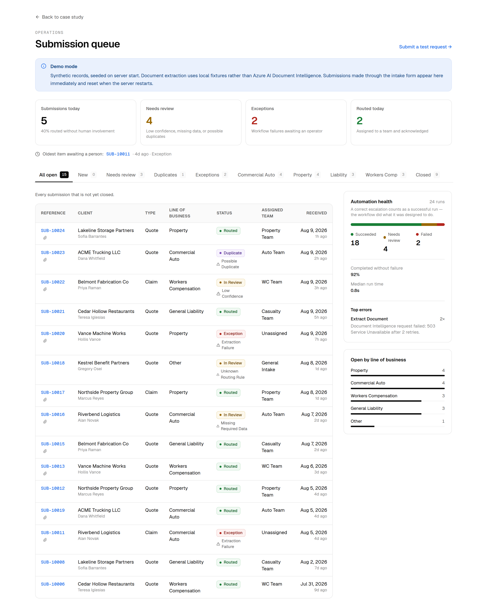

# Insurance Intake & Triage Automation

An AI-enabled insurance workflow that turns incoming submissions and policy
documents into structured, validated, routed records.

**Azure AI · Dataverse · Power Automate · REST APIs**

### ▶ [Run it live](https://insurance-intake-triage-automation.vercel.app)

The system is deployed and running against Azure Document Intelligence and a
hosted Postgres database. [`/intake`](https://insurance-intake-triage-automation.vercel.app/intake)
offers three sample documents — a clean declarations page, the same page
degraded by a simulated fax, and a new-business application — so a submission
can be run end to end without supplying a file. Every run appears in the
[operations dashboard](https://insurance-intake-triage-automation.vercel.app/ops)
with its extraction confidence, the rule that routed it, and a step-by-step
audit log.

> A self-directed case study. This project is not work performed for any
> insurer or broker, and contains no real customer data — every client,
> submission, and document in this repository is synthetic.



---

## Status

| Phase | Deliverable | State |
|---|---|---|
| 0 | Repository + project scaffold | ✅ Complete |
| 1 | Business analysis documentation | ✅ Complete |
| 2 | Data model | ✅ Complete |
| 3 | Digital intake | ✅ Complete |
| 4 | Azure AI Document Intelligence | ✅ Complete |
| 5 | Workflow / automation logic | ✅ Complete |
| 6 | Error handling + human review | ✅ Complete |
| 7 | Operations dashboard | ✅ Complete |
| 8 | Testing + documentation | ✅ Complete |
| 9 | Portfolio case-study page | ✅ Complete |
| 10 | Walkthrough video | ✅ Complete |

**188 automated tests passing.** Type-check, lint, and production build clean.
See [`docs/test-plan.md`](docs/test-plan.md) for recorded results, the five
defects testing found, and the known gaps.

---

## 1. The problem

Insurance intake is, in most organizations, a person reading an email. That
person opens an attachment, reads a declarations page or ACORD form, searches
the CRM for the client, decides whether this is something they have already
seen, retypes the policy details into a record, works out which team owns the
line of business, forwards it, and sends an acknowledgement.

Of roughly twelve minutes of handling per submission, about ten are mechanical
— transcription, search, a routing lookup held in someone's memory. Two are
judgement. The mechanical part is slow, inconsistent between operators, and
gets slower under load. It is also where data quality is decided: duplicate
client records, misrouted submissions, and transposed policy numbers almost all
originate here.

Full analysis: [`docs/current-state.md`](docs/current-state.md).

## 2. What the system does

Separates the two.

```text
Digital intake
      ↓
Automated validation              ← client-side and server-side, same schema
      ↓
AI document extraction            ← probabilistic, per-field confidence
      ↓
Extraction validation             ← schema + required fields + threshold
      ↓
Client match / create             ← normalized email
      ↓
Duplicate detection               ← configurable window
      ↓
Deterministic business rules      ← the routing decision
      ↓
Team assignment + confirmation
      ↓
Audit log + operations dashboard
      ↓
Human review for anything uncertain
```

The governing rule:

> **AI proposes. Deterministic rules decide. Humans arbitrate.**

Extraction produces candidate values and a confidence. Routing is a pure
function of validated inputs — identical inputs always produce the same team.
Low confidence, possible duplicates, missing required data, and unknown routing
rules escalate to a person rather than being resolved by a guess.

The concrete consequence, and the one worth checking: a document whose
extracted policy type is *Workers Compensation*, attached to a submission whose
line of business is *Property*, still routes to the Property Team. The
disagreement becomes a review reason. It does not change the assignment.

## 3. Why it was built

To demonstrate end to end how a business applications problem gets handled: map
the current process, define the data model, write the business rules, integrate
the AI where it earns its place, automate the repeatable steps, build the
exception paths, and document requirements, acceptance criteria, and test cases
so the result can be maintained by someone else.

The design decision the project actually turns on is a rejection. "Point a
document AI at the mailbox" is the obvious approach and it is the wrong one: a
system that treats a 62%-confidence policy number the same as a 98%-confidence
one has not removed manual work, it has moved the error somewhere more
expensive and removed the person who used to catch it.
[`docs/business-case.md`](docs/business-case.md) §6 sets out the four options
and why Option C — full AI autonomy — was rejected.

---

## 4. Architecture

Two layers over one design.

| Concern | Reference implementation (this repo) | Microsoft implementation (documented) |
|---|---|---|
| Intake UI | Next.js route + React form | Power Apps canvas app / Microsoft Forms |
| Data store | Typed in-memory repository, seeded | Microsoft Dataverse tables |
| Orchestration | `lib/workflow` orchestrator, TRY/CATCH/FINALLY | Power Automate cloud flow with Scope actions |
| Extraction | `lib/extraction` adapter → Azure REST or fixtures | Azure AI Document Intelligence connector |
| Ops UI | Next.js dashboard | Model-driven app views |
| Audit | `AutomationLog` records | `AutomationLog` Dataverse table |

Both share the same schema, field names, enumerations, and status vocabulary.
[`power-automate/workflow.md`](power-automate/workflow.md) maps them
action-by-action, and
[`power-automate/expressions.md`](power-automate/expressions.md) pairs each
Power Automate expression with its TypeScript equivalent.

A public portfolio artifact has to be runnable by someone with no licensed
Dataverse environment. Every claim on the case-study page should be executable
by a reader in under two minutes.

```text
Browser ──multipart──► /api/submissions ──► orchestrator ──┬──► client match
 (public)              (Node runtime)     TRY/CATCH/FINALLY ├──► duplicate check
                       server-side only                    ├──► extraction ──┬─ Azure
                                                           ├──► rules        └─ fixture
                                                           ├──► routing
                                                           └──► audit log
```

The browser never contacts Azure. Credentials live only in server environment
variables.

Full note, with the decision log:
[`architecture/architecture-note.md`](architecture/architecture-note.md).

## 5. Data model

Four entities.

```text
CLIENT ──1:N──► SUBMISSION ──1:1──► EXTRACTED POLICY DATA
                     │
                     └────1:N──► AUTOMATION LOG
```

| Entity | Purpose | Key design point |
|---|---|---|
| `Client` | The submitting party | Alternate key on normalized email makes matching a keyed lookup and duplicate creation a constraint violation |
| `Submission` | One quote request or claim | Multi-select review reasons, because a submission can be both a duplicate *and* low-confidence |
| `ExtractedPolicyData` | Output of one extraction | Per-field confidence retained, not just the aggregate |
| `AutomationLog` | One workflow run | `stepFailed` is a Choice, not free text, so "top errors" aggregates reliably |

`confidenceScore` is nullable and the distinction matters: null means "no
document supplied", zero would mean "extraction ran and returned nothing
trustworthy". Collapsing them would make a normal path indistinguishable from a
failure in any report.

- [`dataverse/schema.md`](dataverse/schema.md) — every column, option-set value, key, and security role
- [`dataverse/relationships.md`](dataverse/relationships.md) — cardinality, delete behaviour, and how 1:1 is actually enforced
- [`lib/domain/types.ts`](lib/domain/types.ts) — the same model in TypeScript

## 6. Workflow

Nine steps inside a TRY scope, a CATCH that classifies the failure, and a
FINALLY that always writes the audit log.

| # | Step | Escalates when |
|---|---|---|
| 1 | Validate submission | Rejected at the API before any record is created |
| 2 | Resolve client | — |
| 3 | Persist submission (`Processing`) | Write failure → `Exception` |
| 4 | Duplicate check | Match inside the window → `Duplicate` |
| 5 | Extract document | Service error, timeout, malformed → `Exception` |
| 6 | Validate extraction | Below threshold or missing required field → `In Review` |
| 7 | Apply business rules | No matching rule → General Intake **and** `In Review` |
| 8 | Persist outcome | Write failure → `Exception` |
| 9 | Send confirmation | Only on `Routed` |

Invariants the orchestrator is responsible for: no submission is left in
`Processing`; exactly one automation log is written per run whatever happens;
no exception escapes.

## 7. AI integration

Azure AI Document Intelligence, `prebuilt-layout` by default — no training
corpus required, and the model id is configuration, so a custom-trained ACORD
model is a config change rather than a rewrite. The normalization layer already
reads both response shapes.

Confidence is the arithmetic mean of per-field confidences. Mean rather than
minimum, because a single weak ancillary field should not send an otherwise
clean extraction to review — and the review queue is only useful while the
things in it genuinely need a person. The trade-off, and what bounds it, is
written down in [`ai/extraction-model.md`](ai/extraction-model.md) §5.

| Aggregate | Status | Outcome |
|---|---|---|
| ≥ threshold, required fields present | `Validated` | Routes normally |
| < threshold | `Unverified` | Retained, `In Review` |
| Required field missing | `Failed` | Retained, `In Review` (Intake Correction) |
| Unparseable response | — | `Exception` |

Threshold is **inclusive** and defaults to 0.80. It is the primary dial between
automation benefit and error risk, so it is an environment variable rather than
a constant.

- [`ai/extraction-model.md`](ai/extraction-model.md) — model selection, rejected alternatives, failure taxonomy
- [`ai/validation-rules.md`](ai/validation-rules.md) — every coercion rule, and what is deliberately *not* validated
- [`ai/output-schema.json`](ai/output-schema.json) — the normalized contract

## 8. Business rules

| Line of business | Assigned team |
|---|---|
| Commercial Auto | Auto Team |
| Property | Property Team |
| General Liability | Casualty Team |
| Workers Compensation | WC Team |
| Other | General Intake |
| *(unrecognized)* | General Intake **+ human review** |

Expressed as a data table rather than control flow, so an operations lead can
read it and adding a line of business is a one-line change.

**Duplicate detection.** A submission is a *possible* duplicate when the
client, submission type, and line of business all match a prior submission
inside `DUPLICATE_WINDOW_DAYS` (default 30). Prior submissions in `Exception`
status are excluded — a failed run is not evidence a valid submission already
exists. The flag never rejects, closes, or merges.

**Precedence** when several conditions apply: `Exception` > `Duplicate` >
`In Review` > `Routed`. Precedence decides the status; it does not discard the
other reasons. A submission that is both a duplicate and low-confidence shows
as `Duplicate` and carries both.

## 9. Error handling

An 18-row failure matrix, each row with where it is caught and where the
submission lands:
[`power-automate/error-handling.md`](power-automate/error-handling.md).

```text
        New → Processing ─┬→ Routed ────┐
                          ├→ In Review ─┤
                          ├→ Duplicate ─┼→ Closed
                          └→ Exception ─┘
```

Transitions are declared as data and enforced, so a review handler cannot move
a submission somewhere the design never intended. `Closed` is terminal —
reopening creates a new submission, so the record of what was decided stays
intact.

**Escalation is not failure.** A run that correctly sent a low-confidence
extraction to a human is logged as `Needs Review`, not `Failed`. Counting it as
a failure would make automation health read as broken every time the system did
the right thing.

## 10. Testing

```bash
npm test          # 188 tests
npm run typecheck
npm run lint
npm run build
```

Failure paths are exercised by **injecting failures**, never by disabling code:
a repository that throws on a chosen operation, an extraction adapter that
returns a chosen failure kind, an injected `fetch` for the Azure retry and
timeout paths, and an injected clock so duplicate-window boundaries are exact.

Testing found five defects, two of them silent — `$1,000,000` parsing to `null`
and "Excess Liability" classifying as General Liability. Both produced a
plausible wrong answer with no error. They are written up in
[`docs/test-plan.md`](docs/test-plan.md) §7, along with the known gaps in §8 —
including that the Azure adapter has not yet been run against a live resource.

## 11. Local setup

Requires Node 20 or newer.

```bash
git clone https://github.com/jlbvxf87/Insurance-Intake-Triage-Automation.git
cd Insurance-Intake-Triage-Automation
npm install
cp .env.example .env.local
npm run dev
```

Open `http://localhost:3000`. With no Azure credentials configured the app runs
in **fixture mode** — extraction returns deterministic local fixtures instead
of calling Azure, and the UI says so.

| Route | What it is |
|---|---|
| `/intake` | Public submission form |
| `/ops` | Operations queue, KPIs, automation health |
| `/ops/[id]` | Submission detail, extraction, run trace, review actions |

| Command | Does |
|---|---|
| `npm run dev` | Development server |
| `npm run build` | Production build |
| `npm start` | Serve the production build |
| `npm run lint` | ESLint |
| `npm run typecheck` | `tsc --noEmit` |
| `npm test` | Vitest, single run |
| `npm run test:watch` | Vitest, watch mode |
| `npm run test:coverage` | Vitest with coverage |

### Driving the demo

Fixture selection is by file name, so every path is reachable on demand:

| Upload a file named… | Demonstrates |
|---|---|
| `dec-page.pdf` | Clean straight-through routing |
| `low-confidence-scan.pdf` | Human review on confidence |
| `partial-dec.pdf` | Intake Correction — missing required field |
| `boundary.pdf` | Threshold boundary, inclusive |
| `trigger-timeout.pdf` | Timeout → Exception queue |
| `trigger-error.pdf` | Service error after retries → Exception queue |
| `trigger-malformed.pdf` | Schema failure → Exception queue |

Submitting the same client, type, and line of business twice triggers the
duplicate path.

## 12. Environment variables

All configuration is server-side. No variable is prefixed `NEXT_PUBLIC_`, so no
credential is ever bundled into client JavaScript — enforced by an automated
test, not by review. See [`.env.example`](.env.example) for the annotated
template.

| Variable | Purpose | Default |
|---|---|---|
| `EXTRACTION_PROVIDER` | `auto` \| `azure` \| `fixture` | `auto` |
| `AZURE_DOCUMENT_INTELLIGENCE_ENDPOINT` | Azure resource endpoint | — |
| `AZURE_DOCUMENT_INTELLIGENCE_KEY` | Azure resource key | — |
| `AZURE_DOCUMENT_INTELLIGENCE_MODEL_ID` | Model used to analyze | `prebuilt-layout` |
| `AZURE_DOCUMENT_INTELLIGENCE_API_VERSION` | REST API version | `2024-11-30` |
| `AZURE_REQUEST_TIMEOUT_MS` | Whole-operation deadline | `30000` |
| `EXTRACTION_CONFIDENCE_THRESHOLD` | Below this, human review | `0.80` |
| `DUPLICATE_WINDOW_DAYS` | Duplicate detection window | `30` |
| `MAX_UPLOAD_MB` | Upload size limit | `10` |

`auto` resolves to Azure when an endpoint and key are both present, and to
fixtures otherwise. Setting `azure` explicitly with no credentials fails loudly
rather than silently degrading — an operator who asked for Azure should be told
it is not usable.

`.env` and `.env.local` are gitignored.

## 13. Deployment

The app is a standard Next.js project and deploys to Vercel with no
configuration beyond [`vercel.json`](vercel.json), which is committed.

**From this directory:**

```bash
npx vercel --prod
```

**Or connect the repository:** import it at
[vercel.com/new](https://vercel.com/new), pick this repo, and accept the
detected settings. Every push to `main` then deploys automatically, and every
pull request gets a preview URL.

No environment variables are required. With none set, `EXTRACTION_PROVIDER`
resolves to `fixture` and the app runs in demo mode. To point the hosted demo
at a real Azure resource, set `AZURE_DOCUMENT_INTELLIGENCE_ENDPOINT` and
`AZURE_DOCUMENT_INTELLIGENCE_KEY` in the Vercel project settings — nothing else
changes.

### Persistence

Two implementations sit behind the `Repository` interface, and which one runs
is configuration:

| `DATA_PROVIDER` | Store | Use |
|---|---|---|
| `memory` | In-process, seeded on start | Local development and the test suite. Zero setup |
| `postgres` | Shared Postgres | The hosted demo. Every instance sees the same records |
| `auto` *(default)* | `postgres` when `DATABASE_URL` is set, else `memory` | — |

**Why it matters on Vercel.** Serverless functions scale to many instances. With
the in-memory store, a submission made at `/intake` may be handled by a
different instance than the one rendering `/ops`, so it would not appear there.
With Postgres it always does.

This was the point of the interface, and swapping it cost nothing above the
data layer: the orchestrator, the business rules, and every workflow test are
untouched. What did change is that the two implementations are now held to a
[shared contract test](tests/repository-contract.test.ts) — which immediately
found two places where the in-memory store enforced *less* than the database
(see §10).

**Setting it up:**

1. Apply [`supabase/migrations/0001_create_iit_schema.sql`](supabase/migrations/0001_create_iit_schema.sql).
   It creates an isolated `iit` schema — four tables mirroring the Dataverse
   model, with the same option sets, alternate keys, and delete behaviour.
2. Point the app at it, either way round:
   - **Vercel Supabase integration** (no password handling): Vercel project →
     Storage → Supabase → connect. It injects `POSTGRES_URL`, which the app
     accepts directly.
   - **By hand:** set `DATABASE_URL` to the **shared transaction pooler**
     string — host ends `.pooler.supabase.com`, user is
     `postgres.<project-ref>`, port 6543. Not `db.<ref>.supabase.co`: that host
     is IPv6-only without the IPv4 add-on, and Vercel functions have no IPv6
     egress, so it times out rather than failing cleanly.
3. Set `CRON_SECRET` to any random string.

There is no seed step. The first request to an empty database seeds it, guarded
by a Postgres advisory lock so concurrent cold starts cannot double-seed.

### Keeping the demo clean

The hosted demo is publicly writable, so `vercel.json` schedules
`/api/admin/reset` daily at 07:00 UTC. It truncates and re-seeds, which bounds
how long anything a visitor submits persists and keeps the queue reading as a
realistic operations board.

The endpoint requires `Authorization: Bearer $CRON_SECRET` — the header Vercel
Cron sends automatically. With `CRON_SECRET` unset the endpoint is **disabled**
rather than open.

## 14. Screenshots

Ten screenshots captured from the running application at 1440 px and 390 px:
[`demo/screenshots/`](demo/screenshots). Regenerate with
`node scripts/capture-screenshots.mjs` against a running server.

## 15. Repository layout

```text
app/                Next.js routes — intake, ops dashboard, API
components/         React components grouped by surface
lib/domain/         Types, enums, and Zod schemas — the shared vocabulary
lib/extraction/     Extraction adapter interface, Azure and fixture impls
lib/workflow/       Orchestrator, business rules, duplicates, review, logging
lib/data/           Repository interface, in-memory store, seed, metrics
lib/utils/          Normalization, dates, ids
tests/              Vitest suites — 188 tests
docs/               Business case, current/future state, requirements,
                    acceptance criteria, test plan
dataverse/          Table schema and relationship documentation
ai/                 Extraction model notes, output schema, validation rules
power-automate/     Flow design, expressions, error-handling documentation
sample-data/        Synthetic clients, submissions, extractions (CSV)
architecture/       Architecture note and decision log
scripts/            Sample-data and screenshot generation
demo/screenshots/   Captured UI
```

## 16. Data handling

- All data is synthetic. Company addresses use the reserved `.example` domain,
  so nothing in this repository can resolve to a real mailbox.
- Uploaded documents are held in memory for the duration of the request and are
  never written to disk or committed.
- No document content is logged. Automation logs record provider, model,
  duration, and confidence — never extracted values.
- The demo writes to an in-memory store that resets when the server restarts.
  It does not connect to a live CRM.

## 17. Where to start reading

| If you want to see… | Read |
|---|---|
| The business reasoning | [`docs/business-case.md`](docs/business-case.md) |
| The process analysis | [`docs/current-state.md`](docs/current-state.md), [`docs/future-state.md`](docs/future-state.md) |
| Requirements and acceptance criteria | [`docs/requirements.md`](docs/requirements.md), [`docs/acceptance-criteria.md`](docs/acceptance-criteria.md) |
| The decision log | [`architecture/architecture-note.md`](architecture/architecture-note.md) |
| The core logic | [`lib/workflow/orchestrator.ts`](lib/workflow/orchestrator.ts), [`lib/workflow/business-rules.ts`](lib/workflow/business-rules.ts) |
| The Power Platform mapping | [`power-automate/workflow.md`](power-automate/workflow.md) |
| What was tested and what broke | [`docs/test-plan.md`](docs/test-plan.md) |

---

## License

MIT — see [`LICENSE`](LICENSE).
